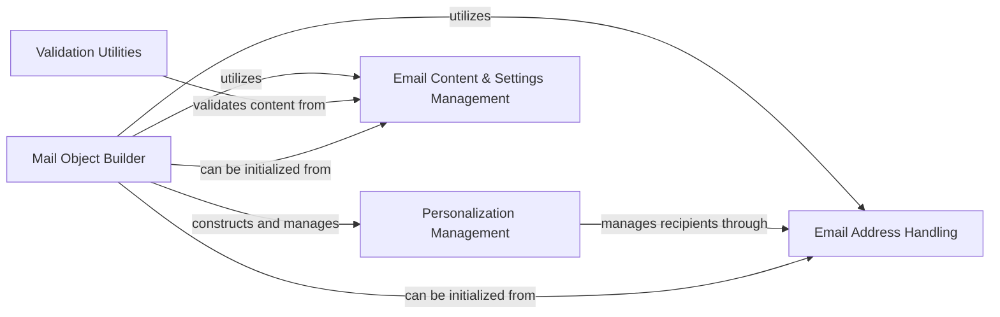

## Component Details

This component overview describes the structure, flow, and purpose of the email construction and management subsystem within the project. It identifies key components responsible for building email messages, handling personalization, managing content and settings, and validating email addresses and content. The main flow involves the 'Mail Object Builder' aggregating various email elements provided by 'Email Content & Settings Management' and 'Email Address Handling', with 'Personalization Management' allowing for recipient-specific customizations. 'Validation Utilities' ensure the integrity and security of the email content.

### Mail Object Builder
The Mail Object Builder component, primarily represented by the `Mail` class, is responsible for constructing the entire email message payload according to the SendGrid v3 API specification. It aggregates various email components like recipients (To, Cc, Bcc), subject, content (plain text, HTML, AMP HTML), attachments, headers, substitutions, custom arguments, and other mail settings. It provides methods to add and manage these components, ensuring the final output is a JSON-ready representation suitable for the SendGrid API.

**Related Classes/Methods**:

- <a href="https://github.com/sendgrid/sendgrid-python/blob/master/sendgrid/helpers/mail/mail.py#L20-L1041" target="_blank" rel="noopener noreferrer">`sendgrid.helpers.mail.mail.Mail` (20:1041)</a>
- <a href="https://github.com/sendgrid/sendgrid-python/blob/master/sendgrid/helpers/mail/mail.py#L23-L81" target="_blank" rel="noopener noreferrer">`sendgrid.helpers.mail.mail.Mail:__init__` (23:81)</a>
- <a href="https://github.com/sendgrid/sendgrid-python/blob/master/sendgrid/helpers/mail/mail.py#L83-L89" target="_blank" rel="noopener noreferrer">`sendgrid.helpers.mail.mail.Mail:__str__` (83:89)</a>
- <a href="https://github.com/sendgrid/sendgrid-python/blob/master/sendgrid/helpers/mail/mail.py#L91-L103" target="_blank" rel="noopener noreferrer">`sendgrid.helpers.mail.mail.Mail._ensure_append` (91:103)</a>
- <a href="https://github.com/sendgrid/sendgrid-python/blob/master/sendgrid/helpers/mail/mail.py#L105-L115" target="_blank" rel="noopener noreferrer">`sendgrid.helpers.mail.mail.Mail._ensure_insert` (105:115)</a>
- <a href="https://github.com/sendgrid/sendgrid-python/blob/master/sendgrid/helpers/mail/mail.py#L117-L125" target="_blank" rel="noopener noreferrer">`sendgrid.helpers.mail.mail.Mail._flatten_dicts` (117:125)</a>
- <a href="https://github.com/sendgrid/sendgrid-python/blob/master/sendgrid/helpers/mail/mail.py#L127-L134" target="_blank" rel="noopener noreferrer">`sendgrid.helpers.mail.mail.Mail._get_or_none` (127:134)</a>
- <a href="https://github.com/sendgrid/sendgrid-python/blob/master/sendgrid/helpers/mail/mail.py#L136-L191" target="_blank" rel="noopener noreferrer">`sendgrid.helpers.mail.mail.Mail._set_emails` (136:191)</a>
- <a href="https://github.com/sendgrid/sendgrid-python/blob/master/sendgrid/helpers/mail/mail.py#L194-L199" target="_blank" rel="noopener noreferrer">`sendgrid.helpers.mail.mail.Mail.personalizations` (194:199)</a>
- <a href="https://github.com/sendgrid/sendgrid-python/blob/master/sendgrid/helpers/mail/mail.py#L201-L210" target="_blank" rel="noopener noreferrer">`sendgrid.helpers.mail.mail.Mail.add_personalization` (201:210)</a>
- <a href="https://github.com/sendgrid/sendgrid-python/blob/master/sendgrid/helpers/mail/mail.py#L213-L214" target="_blank" rel="noopener noreferrer">`sendgrid.helpers.mail.mail.Mail.to` (213:214)</a>
- <a href="https://github.com/sendgrid/sendgrid-python/blob/master/sendgrid/helpers/mail/mail.py#L244-L277" target="_blank" rel="noopener noreferrer">`sendgrid.helpers.mail.mail.Mail.add_to` (244:277)</a>
- <a href="https://github.com/sendgrid/sendgrid-python/blob/master/sendgrid/helpers/mail/mail.py#L280-L281" target="_blank" rel="noopener noreferrer">`sendgrid.helpers.mail.mail.Mail.cc` (280:281)</a>
- <a href="https://github.com/sendgrid/sendgrid-python/blob/master/sendgrid/helpers/mail/mail.py#L311-L332" target="_blank" rel="noopener noreferrer">`sendgrid.helpers.mail.mail.Mail.add_cc` (311:332)</a>
- <a href="https://github.com/sendgrid/sendgrid-python/blob/master/sendgrid/helpers/mail/mail.py#L335-L336" target="_blank" rel="noopener noreferrer">`sendgrid.helpers.mail.mail.Mail.bcc` (335:336)</a>
- <a href="https://github.com/sendgrid/sendgrid-python/blob/master/sendgrid/helpers/mail/mail.py#L371-L399" target="_blank" rel="noopener noreferrer">`sendgrid.helpers.mail.mail.Mail.add_bcc` (371:399)</a>
- <a href="https://github.com/sendgrid/sendgrid-python/blob/master/sendgrid/helpers/mail/mail.py#L402-L407" target="_blank" rel="noopener noreferrer">`sendgrid.helpers.mail.mail.Mail.subject` (402:407)</a>
- <a href="https://github.com/sendgrid/sendgrid-python/blob/master/sendgrid/helpers/mail/mail.py#L437-L442" target="_blank" rel="noopener noreferrer">`sendgrid.helpers.mail.mail.Mail.headers` (437:442)</a>
- <a href="https://github.com/sendgrid/sendgrid-python/blob/master/sendgrid/helpers/mail/mail.py#L445-L446" target="_blank" rel="noopener noreferrer">`sendgrid.helpers.mail.mail.Mail.header` (445:446)</a>
- <a href="https://github.com/sendgrid/sendgrid-python/blob/master/sendgrid/helpers/mail/mail.py#L461-L491" target="_blank" rel="noopener noreferrer">`sendgrid.helpers.mail.mail.Mail.add_header` (461:491)</a>
- <a href="https://github.com/sendgrid/sendgrid-python/blob/master/sendgrid/helpers/mail/mail.py#L494-L495" target="_blank" rel="noopener noreferrer">`sendgrid.helpers.mail.mail.Mail.substitution` (494:495)</a>
- <a href="https://github.com/sendgrid/sendgrid-python/blob/master/sendgrid/helpers/mail/mail.py#L510-L536" target="_blank" rel="noopener noreferrer">`sendgrid.helpers.mail.mail.Mail.add_substitution` (510:536)</a>
- <a href="https://github.com/sendgrid/sendgrid-python/blob/master/sendgrid/helpers/mail/mail.py#L539-L544" target="_blank" rel="noopener noreferrer">`sendgrid.helpers.mail.mail.Mail.custom_args` (539:544)</a>
- <a href="https://github.com/sendgrid/sendgrid-python/blob/master/sendgrid/helpers/mail/mail.py#L547-L548" target="_blank" rel="noopener noreferrer">`sendgrid.helpers.mail.mail.Mail.custom_arg` (547:548)</a>
- <a href="https://github.com/sendgrid/sendgrid-python/blob/master/sendgrid/helpers/mail/mail.py#L564-L594" target="_blank" rel="noopener noreferrer">`sendgrid.helpers.mail.mail.Mail.add_custom_arg` (564:594)</a>
- <a href="https://github.com/sendgrid/sendgrid-python/blob/master/sendgrid/helpers/mail/mail.py#L597-L602" target="_blank" rel="noopener noreferrer">`sendgrid.helpers.mail.mail.Mail.send_at` (597:602)</a>
- <a href="https://github.com/sendgrid/sendgrid-python/blob/master/sendgrid/helpers/mail/mail.py#L633-L634" target="_blank" rel="noopener noreferrer">`sendgrid.helpers.mail.mail.Mail.dynamic_template_data` (633:634)</a>
- <a href="https://github.com/sendgrid/sendgrid-python/blob/master/sendgrid/helpers/mail/mail.py#L658-L663" target="_blank" rel="noopener noreferrer">`sendgrid.helpers.mail.mail.Mail.from_email` (658:663)</a>
- <a href="https://github.com/sendgrid/sendgrid-python/blob/master/sendgrid/helpers/mail/mail.py#L679-L684" target="_blank" rel="noopener noreferrer">`sendgrid.helpers.mail.mail.Mail.reply_to` (679:684)</a>
- <a href="https://github.com/sendgrid/sendgrid-python/blob/master/sendgrid/helpers/mail/mail.py#L700-L705" target="_blank" rel="noopener noreferrer">`sendgrid.helpers.mail.mail.Mail.reply_to_list` (700:705)</a>
- <a href="https://github.com/sendgrid/sendgrid-python/blob/master/sendgrid/helpers/mail/mail.py#L726-L731" target="_blank" rel="noopener noreferrer">`sendgrid.helpers.mail.mail.Mail.contents` (726:731)</a>
- <a href="https://github.com/sendgrid/sendgrid-python/blob/master/sendgrid/helpers/mail/mail.py#L734-L735" target="_blank" rel="noopener noreferrer">`sendgrid.helpers.mail.mail.Mail.content` (734:735)</a>
- <a href="https://github.com/sendgrid/sendgrid-python/blob/master/sendgrid/helpers/mail/mail.py#L750-L783" target="_blank" rel="noopener noreferrer">`sendgrid.helpers.mail.mail.Mail.add_content` (750:783)</a>
- <a href="https://github.com/sendgrid/sendgrid-python/blob/master/sendgrid/helpers/mail/mail.py#L786-L791" target="_blank" rel="noopener noreferrer">`sendgrid.helpers.mail.mail.Mail.attachments` (786:791)</a>
- <a href="https://github.com/sendgrid/sendgrid-python/blob/master/sendgrid/helpers/mail/mail.py#L794-L795" target="_blank" rel="noopener noreferrer">`sendgrid.helpers.mail.mail.Mail.attachment` (794:795)</a>
- <a href="https://github.com/sendgrid/sendgrid-python/blob/master/sendgrid/helpers/mail/mail.py#L810-L816" target="_blank" rel="noopener noreferrer">`sendgrid.helpers.mail.mail.Mail.add_attachment` (810:816)</a>
- <a href="https://github.com/sendgrid/sendgrid-python/blob/master/sendgrid/helpers/mail/mail.py#L819-L824" target="_blank" rel="noopener noreferrer">`sendgrid.helpers.mail.mail.Mail.template_id` (819:824)</a>
- <a href="https://github.com/sendgrid/sendgrid-python/blob/master/sendgrid/helpers/mail/mail.py#L839-L844" target="_blank" rel="noopener noreferrer">`sendgrid.helpers.mail.mail.Mail.sections` (839:844)</a>
- <a href="https://github.com/sendgrid/sendgrid-python/blob/master/sendgrid/helpers/mail/mail.py#L847-L848" target="_blank" rel="noopener noreferrer">`sendgrid.helpers.mail.mail.Mail.section` (847:848)</a>
- <a href="https://github.com/sendgrid/sendgrid-python/blob/master/sendgrid/helpers/mail/mail.py#L862-L868" target="_blank" rel="noopener noreferrer">`sendgrid.helpers.mail.mail.Mail.add_section` (862:868)</a>
- <a href="https://github.com/sendgrid/sendgrid-python/blob/master/sendgrid/helpers/mail/mail.py#L871-L876" target="_blank" rel="noopener noreferrer">`sendgrid.helpers.mail.mail.Mail.categories` (871:876)</a>
- <a href="https://github.com/sendgrid/sendgrid-python/blob/master/sendgrid/helpers/mail/mail.py#L879-L880" target="_blank" rel="noopener noreferrer">`sendgrid.helpers.mail.mail.Mail.category` (879:880)</a>
- <a href="https://github.com/sendgrid/sendgrid-python/blob/master/sendgrid/helpers/mail/mail.py#L894-L899" target="_blank" rel="noopener noreferrer">`sendgrid.helpers.mail.mail.Mail.add_category` (894:899)</a>
- <a href="https://github.com/sendgrid/sendgrid-python/blob/master/sendgrid/helpers/mail/mail.py#L902-L907" target="_blank" rel="noopener noreferrer">`sendgrid.helpers.mail.mail.Mail.batch_id` (902:907)</a>
- <a href="https://github.com/sendgrid/sendgrid-python/blob/master/sendgrid/helpers/mail/mail.py#L919-L924" target="_blank" rel="noopener noreferrer">`sendgrid.helpers.mail.mail.Mail.asm` (919:924)</a>
- <a href="https://github.com/sendgrid/sendgrid-python/blob/master/sendgrid/helpers/mail/mail.py#L936-L941" target="_blank" rel="noopener noreferrer">`sendgrid.helpers.mail.mail.Mail.ip_pool_name` (936:941)</a>
- <a href="https://github.com/sendgrid/sendgrid-python/blob/master/sendgrid/helpers/mail/mail.py#L953-L958" target="_blank" rel="noopener noreferrer">`sendgrid.helpers.mail.mail.Mail.mail_settings` (953:958)</a>
- <a href="https://github.com/sendgrid/sendgrid-python/blob/master/sendgrid/helpers/mail/mail.py#L970-L975" target="_blank" rel="noopener noreferrer">`sendgrid.helpers.mail.mail.Mail.tracking_settings` (970:975)</a>
- <a href="https://github.com/sendgrid/sendgrid-python/blob/master/sendgrid/helpers/mail/mail.py#L986-L1015" target="_blank" rel="noopener noreferrer">`sendgrid.helpers.mail.mail.Mail.get` (986:1015)</a>
- <a href="https://github.com/sendgrid/sendgrid-python/blob/master/sendgrid/helpers/mail/mail.py#L1018-L1041" target="_blank" rel="noopener noreferrer">`sendgrid.helpers.mail.mail.Mail.from_EmailMessage` (1018:1041)</a>

### Personalization Management
The Personalization Management component, centered around the `Personalization` class, handles the specific details for individual recipients or groups of recipients within an email. It allows for setting 'To', 'Cc', and 'Bcc' email addresses, as well as personalizing subject lines, headers, substitutions, custom arguments, and send times for each personalization. This component ensures that emails can be tailored to different recipients while still being part of a single SendGrid API call.

**Related Classes/Methods**:

- <a href="https://github.com/sendgrid/sendgrid-python/blob/master/sendgrid/helpers/mail/personalization.py#L1-L271" target="_blank" rel="noopener noreferrer">`sendgrid.helpers.mail.personalization.Personalization` (1:271)</a>
- <a href="https://github.com/sendgrid/sendgrid-python/blob/master/sendgrid/helpers/mail/personalization.py#L6-L17" target="_blank" rel="noopener noreferrer">`sendgrid.helpers.mail.personalization.Personalization:__init__` (6:17)</a>
- <a href="https://github.com/sendgrid/sendgrid-python/blob/master/sendgrid/helpers/mail/personalization.py#L19-L33" target="_blank" rel="noopener noreferrer">`sendgrid.helpers.mail.personalization.Personalization.add_email` (19:33)</a>
- <a href="https://github.com/sendgrid/sendgrid-python/blob/master/sendgrid/helpers/mail/personalization.py#L35-L46" target="_blank" rel="noopener noreferrer">`sendgrid.helpers.mail.personalization.Personalization._get_unique_recipients` (35:46)</a>
- <a href="https://github.com/sendgrid/sendgrid-python/blob/master/sendgrid/helpers/mail/personalization.py#L50-L55" target="_blank" rel="noopener noreferrer">`sendgrid.helpers.mail.personalization.Personalization.tos` (50:55)</a>
- <a href="https://github.com/sendgrid/sendgrid-python/blob/master/sendgrid/helpers/mail/personalization.py#L61-L82" target="_blank" rel="noopener noreferrer">`sendgrid.helpers.mail.personalization.Personalization.add_to` (61:82)</a>
- <a href="https://github.com/sendgrid/sendgrid-python/blob/master/sendgrid/helpers/mail/personalization.py#L85-L86" target="_blank" rel="noopener noreferrer">`sendgrid.helpers.mail.personalization.Personalization.from_email` (85:86)</a>
- <a href="https://github.com/sendgrid/sendgrid-python/blob/master/sendgrid/helpers/mail/personalization.py#L92-L93" target="_blank" rel="noopener noreferrer">`sendgrid.helpers.mail.personalization.Personalization.set_from` (92:93)</a>
- <a href="https://github.com/sendgrid/sendgrid-python/blob/master/sendgrid/helpers/mail/personalization.py#L96-L101" target="_blank" rel="noopener noreferrer">`sendgrid.helpers.mail.personalization.Personalization.ccs` (96:101)</a>
- <a href="https://github.com/sendgrid/sendgrid-python/blob/master/sendgrid/helpers/mail/personalization.py#L107-L113" target="_blank" rel="noopener noreferrer">`sendgrid.helpers.mail.personalization.Personalization.add_cc` (107:113)</a>
- <a href="https://github.com/sendgrid/sendgrid-python/blob/master/sendgrid/helpers/mail/personalization.py#L116-L121" target="_blank" rel="noopener noreferrer">`sendgrid.helpers.mail.personalization.Personalization.bccs` (116:121)</a>
- <a href="https://github.com/sendgrid/sendgrid-python/blob/master/sendgrid/helpers/mail/personalization.py#L127-L133" target="_blank" rel="noopener noreferrer">`sendgrid.helpers.mail.personalization.Personalization.add_bcc` (127:133)</a>
- <a href="https://github.com/sendgrid/sendgrid-python/blob/master/sendgrid/helpers/mail/personalization.py#L136-L144" target="_blank" rel="noopener noreferrer">`sendgrid.helpers.mail.personalization.Personalization.subject` (136:144)</a>
- <a href="https://github.com/sendgrid/sendgrid-python/blob/master/sendgrid/helpers/mail/personalization.py#L151-L156" target="_blank" rel="noopener noreferrer">`sendgrid.helpers.mail.personalization.Personalization.headers` (151:156)</a>
- <a href="https://github.com/sendgrid/sendgrid-python/blob/master/sendgrid/helpers/mail/personalization.py#L162-L167" target="_blank" rel="noopener noreferrer">`sendgrid.helpers.mail.personalization.Personalization.add_header` (162:167)</a>
- <a href="https://github.com/sendgrid/sendgrid-python/blob/master/sendgrid/helpers/mail/personalization.py#L170-L175" target="_blank" rel="noopener noreferrer">`sendgrid.helpers.mail.personalization.Personalization.substitutions` (170:175)</a>
- <a href="https://github.com/sendgrid/sendgrid-python/blob/master/sendgrid/helpers/mail/personalization.py#L181-L189" target="_blank" rel="noopener noreferrer">`sendgrid.helpers.mail.personalization.Personalization.add_substitution` (181:189)</a>
- <a href="https://github.com/sendgrid/sendgrid-python/blob/master/sendgrid/helpers/mail/personalization.py#L192-L197" target="_blank" rel="noopener noreferrer">`sendgrid.helpers.mail.personalization.Personalization.custom_args` (192:197)</a>
- <a href="https://github.com/sendgrid/sendgrid-python/blob/master/sendgrid/helpers/mail/personalization.py#L203-L208" target="_blank" rel="noopener noreferrer">`sendgrid.helpers.mail.personalization.Personalization.add_custom_arg` (203:208)</a>
- <a href="https://github.com/sendgrid/sendgrid-python/blob/master/sendgrid/helpers/mail/personalization.py#L211-L218" target="_blank" rel="noopener noreferrer">`sendgrid.helpers.mail.personalization.Personalization.send_at` (211:218)</a>
- <a href="https://github.com/sendgrid/sendgrid-python/blob/master/sendgrid/helpers/mail/personalization.py#L225-L231" target="_blank" rel="noopener noreferrer">`sendgrid.helpers.mail.personalization.Personalization.dynamic_template_data` (225:231)</a>
- <a href="https://github.com/sendgrid/sendgrid-python/blob/master/sendgrid/helpers/mail/personalization.py#L240-L271" target="_blank" rel="noopener noreferrer">`sendgrid.helpers.mail.personalization.Personalization.get` (240:271)</a>

### Email Content & Settings Management
This component handles the various types of email content (plain text, HTML, AMP HTML), attachments, and global email settings such as sender/reply-to addresses, subject, headers, template IDs, categories, and tracking options. It provides classes that act as data containers for their respective email elements, often providing methods to retrieve their JSON representation, and are fundamental building blocks for constructing a complete email.

**Related Classes/Methods**:

- <a href="https://github.com/sendgrid/sendgrid-python/blob/master/sendgrid/helpers/mail/content.py#L5-L81" target="_blank" rel="noopener noreferrer">`sendgrid.helpers.mail.content.Content` (5:81)</a>
- <a href="https://github.com/sendgrid/sendgrid-python/blob/master/sendgrid/helpers/mail/content.py#L11-L27" target="_blank" rel="noopener noreferrer">`sendgrid.helpers.mail.content.Content:__init__` (11:27)</a>
- <a href="https://github.com/sendgrid/sendgrid-python/blob/master/sendgrid/helpers/mail/content.py#L51-L56" target="_blank" rel="noopener noreferrer">`sendgrid.helpers.mail.content.Content:content` (51:56)</a>
- <a href="https://github.com/sendgrid/sendgrid-python/blob/master/sendgrid/helpers/mail/plain_text_content.py#L5-L60" target="_blank" rel="noopener noreferrer">`sendgrid.helpers.mail.plain_text_content.PlainTextContent` (5:60)</a>
- <a href="https://github.com/sendgrid/sendgrid-python/blob/master/sendgrid/helpers/mail/plain_text_content.py#L9-L19" target="_blank" rel="noopener noreferrer">`sendgrid.helpers.mail.plain_text_content.PlainTextContent:__init__` (9:19)</a>
- <a href="https://github.com/sendgrid/sendgrid-python/blob/master/sendgrid/helpers/mail/plain_text_content.py#L30-L35" target="_blank" rel="noopener noreferrer">`sendgrid.helpers.mail.plain_text_content.PlainTextContent:content` (30:35)</a>
- <a href="https://github.com/sendgrid/sendgrid-python/blob/master/sendgrid/helpers/mail/html_content.py#L5-L59" target="_blank" rel="noopener noreferrer">`sendgrid.helpers.mail.html_content.HtmlContent` (5:59)</a>
- <a href="https://github.com/sendgrid/sendgrid-python/blob/master/sendgrid/helpers/mail/html_content.py#L8-L18" target="_blank" rel="noopener noreferrer">`sendgrid.helpers.mail.html_content.HtmlContent:__init__` (8:18)</a>
- <a href="https://github.com/sendgrid/sendgrid-python/blob/master/sendgrid/helpers/mail/html_content.py#L29-L34" target="_blank" rel="noopener noreferrer">`sendgrid.helpers.mail.html_content.HtmlContent:content` (29:34)</a>
- <a href="https://github.com/sendgrid/sendgrid-python/blob/master/sendgrid/helpers/mail/amp_html_content.py#L5-L59" target="_blank" rel="noopener noreferrer">`sendgrid.helpers.mail.amp_html_content.AmpHtmlContent` (5:59)</a>
- <a href="https://github.com/sendgrid/sendgrid-python/blob/master/sendgrid/helpers/mail/amp_html_content.py#L8-L18" target="_blank" rel="noopener noreferrer">`sendgrid.helpers.mail.amp_html_content.AmpHtmlContent:__init__` (8:18)</a>
- <a href="https://github.com/sendgrid/sendgrid-python/blob/master/sendgrid/helpers/mail/amp_html_content.py#L29-L34" target="_blank" rel="noopener noreferrer">`sendgrid.helpers.mail.amp_html_content.AmpHtmlContent:content` (29:34)</a>
- <a href="https://github.com/sendgrid/sendgrid-python/blob/master/sendgrid/helpers/mail/attachment.py#L8-L218" target="_blank" rel="noopener noreferrer">`sendgrid.helpers.mail.attachment.Attachment` (8:218)</a>
- <a href="https://github.com/sendgrid/sendgrid-python/blob/master/sendgrid/helpers/mail/attachment.py#L65-L70" target="_blank" rel="noopener noreferrer">`sendgrid.helpers.mail.attachment.Attachment:file_content` (65:70)</a>
- <a href="https://github.com/sendgrid/sendgrid-python/blob/master/sendgrid/helpers/mail/attachment.py#L85-L90" target="_blank" rel="noopener noreferrer">`sendgrid.helpers.mail.attachment.Attachment:file_name` (85:90)</a>
- <a href="https://github.com/sendgrid/sendgrid-python/blob/master/sendgrid/helpers/mail/attachment.py#L105-L110" target="_blank" rel="noopener noreferrer">`sendgrid.helpers.mail.attachment.Attachment:file_type` (105:110)</a>
- <a href="https://github.com/sendgrid/sendgrid-python/blob/master/sendgrid/helpers/mail/attachment.py#L125-L137" target="_blank" rel="noopener noreferrer">`sendgrid.helpers.mail.attachment.Attachment:disposition` (125:137)</a>
- <a href="https://github.com/sendgrid/sendgrid-python/blob/master/sendgrid/helpers/mail/attachment.py#L168-L176" target="_blank" rel="noopener noreferrer">`sendgrid.helpers.mail.attachment.Attachment:content_id` (168:176)</a>
- <a href="https://github.com/sendgrid/sendgrid-python/blob/master/sendgrid/helpers/mail/content_id.py#L1-L50" target="_blank" rel="noopener noreferrer">`sendgrid.helpers.mail.content_id.ContentId` (1:50)</a>
- <a href="https://github.com/sendgrid/sendgrid-python/blob/master/sendgrid/helpers/mail/disposition.py#L1-L72" target="_blank" rel="noopener noreferrer">`sendgrid.helpers.mail.disposition.Disposition` (1:72)</a>
- <a href="https://github.com/sendgrid/sendgrid-python/blob/master/sendgrid/helpers/mail/file_content.py#L1-L39" target="_blank" rel="noopener noreferrer">`sendgrid.helpers.mail.file_content.FileContent` (1:39)</a>
- <a href="https://github.com/sendgrid/sendgrid-python/blob/master/sendgrid/helpers/mail/file_name.py#L1-L39" target="_blank" rel="noopener noreferrer">`sendgrid.helpers.mail.file_name.FileName` (1:39)</a>
- <a href="https://github.com/sendgrid/sendgrid-python/blob/master/sendgrid/helpers/mail/file_type.py#L1-L39" target="_blank" rel="noopener noreferrer">`sendgrid.helpers.mail.file_type.FileType` (1:39)</a>
- <a href="https://github.com/sendgrid/sendgrid-python/blob/master/sendgrid/helpers/mail/subject.py#L1-L69" target="_blank" rel="noopener noreferrer">`sendgrid.helpers.mail.subject.Subject` (1:69)</a>
- <a href="https://github.com/sendgrid/sendgrid-python/blob/master/sendgrid/helpers/mail/subject.py#L55-L60" target="_blank" rel="noopener noreferrer">`sendgrid.helpers.mail.subject.Subject:__str__` (55:60)</a>
- <a href="https://github.com/sendgrid/sendgrid-python/blob/master/sendgrid/helpers/mail/subject.py#L62-L69" target="_blank" rel="noopener noreferrer">`sendgrid.helpers.mail.subject.Subject.get` (62:69)</a>
- <a href="https://github.com/sendgrid/sendgrid-python/blob/master/sendgrid/helpers/mail/header.py#L1-L94" target="_blank" rel="noopener noreferrer">`sendgrid.helpers.mail.header.Header` (1:94)</a>
- <a href="https://github.com/sendgrid/sendgrid-python/blob/master/sendgrid/helpers/mail/from_email.py#L4-L5" target="_blank" rel="noopener noreferrer">`sendgrid.helpers.mail.from_email.From` (4:5)</a>
- <a href="https://github.com/sendgrid/sendgrid-python/blob/master/sendgrid/helpers/mail/reply_to.py#L4-L5" target="_blank" rel="noopener noreferrer">`sendgrid.helpers.mail.reply_to.ReplyTo` (4:5)</a>
- <a href="https://github.com/sendgrid/sendgrid-python/blob/master/sendgrid/helpers/mail/template_id.py#L1-L39" target="_blank" rel="noopener noreferrer">`sendgrid.helpers.mail.template_id.TemplateId` (1:39)</a>
- <a href="https://github.com/sendgrid/sendgrid-python/blob/master/sendgrid/helpers/mail/section.py#L1-L64" target="_blank" rel="noopener noreferrer">`sendgrid.helpers.mail.section.Section` (1:64)</a>
- <a href="https://github.com/sendgrid/sendgrid-python/blob/master/sendgrid/helpers/mail/category.py#L1-L40" target="_blank" rel="noopener noreferrer">`sendgrid.helpers.mail.category.Category` (1:40)</a>
- <a href="https://github.com/sendgrid/sendgrid-python/blob/master/sendgrid/helpers/mail/ganalytics.py#L1-L176" target="_blank" rel="noopener noreferrer">`sendgrid.helpers.mail.ganalytics.Ganalytics` (1:176)</a>
- <a href="https://github.com/sendgrid/sendgrid-python/blob/master/sendgrid/helpers/mail/batch_id.py#L1-L50" target="_blank" rel="noopener noreferrer">`sendgrid.helpers.mail.batch_id.BatchId` (1:50)</a>
- <a href="https://github.com/sendgrid/sendgrid-python/blob/master/sendgrid/helpers/mail/batch_id.py#L36-L41" target="_blank" rel="noopener noreferrer">`sendgrid.helpers.mail.batch_id.BatchId:__str__` (36:41)</a>
- <a href="https://github.com/sendgrid/sendgrid-python/blob/master/sendgrid/helpers/mail/batch_id.py#L43-L50" target="_blank" rel="noopener noreferrer">`sendgrid.helpers.mail.batch_id.BatchId.get` (43:50)</a>
- <a href="https://github.com/sendgrid/sendgrid-python/blob/master/sendgrid/helpers/mail/asm.py#L5-L80" target="_blank" rel="noopener noreferrer">`sendgrid.helpers.mail.asm.Asm` (5:80)</a>
- <a href="https://github.com/sendgrid/sendgrid-python/blob/master/sendgrid/helpers/mail/asm.py#L26-L31" target="_blank" rel="noopener noreferrer">`sendgrid.helpers.mail.asm.Asm:group_id` (26:31)</a>
- <a href="https://github.com/sendgrid/sendgrid-python/blob/master/sendgrid/helpers/mail/asm.py#L46-L52" target="_blank" rel="noopener noreferrer">`sendgrid.helpers.mail.asm.Asm:groups_to_display` (46:52)</a>
- <a href="https://github.com/sendgrid/sendgrid-python/blob/master/sendgrid/helpers/mail/spam_check.py#L5-L112" target="_blank" rel="noopener noreferrer">`sendgrid.helpers.mail.spam_check.SpamCheck` (5:112)</a>
- <a href="https://github.com/sendgrid/sendgrid-python/blob/master/sendgrid/helpers/mail/spam_check.py#L47-L54" target="_blank" rel="noopener noreferrer">`sendgrid.helpers.mail.spam_check.SpamCheck:threshold` (47:54)</a>
- <a href="https://github.com/sendgrid/sendgrid-python/blob/master/sendgrid/helpers/mail/spam_check.py#L74-L80" target="_blank" rel="noopener noreferrer">`sendgrid.helpers.mail.spam_check.SpamCheck:post_to_url` (74:80)</a>
- <a href="https://github.com/sendgrid/sendgrid-python/blob/master/sendgrid/helpers/mail/spam_threshold.py#L1-L53" target="_blank" rel="noopener noreferrer">`sendgrid.helpers.mail.spam_threshold.SpamThreshold` (1:53)</a>
- <a href="https://github.com/sendgrid/sendgrid-python/blob/master/sendgrid/helpers/mail/spam_url.py#L1-L44" target="_blank" rel="noopener noreferrer">`sendgrid.helpers.mail.spam_url.SpamUrl` (1:44)</a>
- <a href="https://github.com/sendgrid/sendgrid-python/blob/master/sendgrid/helpers/mail/ip_pool_name.py#L1-L40" target="_blank" rel="noopener noreferrer">`sendgrid.helpers.mail.ip_pool_name.IpPoolName` (1:40)</a>
- <a href="https://github.com/sendgrid/sendgrid-python/blob/master/sendgrid/helpers/mail/mail_settings.py#L1-L243" target="_blank" rel="noopener noreferrer">`sendgrid.helpers.mail.mail_settings.MailSettings` (1:243)</a>
- <a href="https://github.com/sendgrid/sendgrid-python/blob/master/sendgrid/helpers/mail/mail_settings.py#L4-L69" target="_blank" rel="noopener noreferrer">`sendgrid.helpers.mail.mail_settings.MailSettings:__init__` (4:69)</a>
- <a href="https://github.com/sendgrid/sendgrid-python/blob/master/sendgrid/helpers/mail/mail_settings.py#L72-L77" target="_blank" rel="noopener noreferrer">`sendgrid.helpers.mail.mail_settings.MailSettings:bcc_settings` (72:77)</a>
- <a href="https://github.com/sendgrid/sendgrid-python/blob/master/sendgrid/helpers/mail/mail_settings.py#L89-L94" target="_blank" rel="noopener noreferrer">`sendgrid.helpers.mail.mail_settings.MailSettings:bypass_bounce_management` (89:94)</a>
- <a href="https://github.com/sendgrid/sendgrid-python/blob/master/sendgrid/helpers/mail/mail_settings.py#L106-L111" target="_blank" rel="noopener noreferrer">`sendgrid.helpers.mail.mail_settings.MailSettings:bypass_list_management` (106:111)</a>
- <a href="https://github.com/sendgrid/sendgrid-python/blob/master/sendgrid/helpers/mail/mail_settings.py#L123-L128" target="_blank" rel="noopener noreferrer">`sendgrid.helpers.mail.mail_settings.MailSettings:bypass_spam_management` (123:128)</a>
- <a href="https://github.com/sendgrid/sendgrid-python/blob/master/sendgrid/helpers/mail/mail_settings.py#L140-L145" target="_blank" rel="noopener noreferrer">`sendgrid.helpers.mail.mail_settings.MailSettings:bypass_unsubscribe_management` (140:145)</a>
- <a href="https://github.com/sendgrid/sendgrid-python/blob/master/sendgrid/helpers/mail/mail_settings.py#L157-L162" target="_blank" rel="noopener noreferrer">`sendgrid.helpers.mail.mail_settings.MailSettings:footer_settings` (157:162)</a>
- <a href="https://github.com/sendgrid/sendgrid-python/blob/master/sendgrid/helpers/mail/mail_settings.py#L174-L179" target="_blank" rel="noopener noreferrer">`sendgrid.helpers.mail.mail_settings.MailSettings:sandbox_mode` (174:179)</a>
- <a href="https://github.com/sendgrid/sendgrid-python/blob/master/sendgrid/helpers/mail/mail_settings.py#L191-L196" target="_blank" rel="noopener noreferrer">`sendgrid.helpers.mail.mail_settings.MailSettings:spam_check` (191:196)</a>
- <a href="https://github.com/sendgrid/sendgrid-python/blob/master/sendgrid/helpers/mail/mail_settings.py#L208-L243" target="_blank" rel="noopener noreferrer">`sendgrid.helpers.mail.mail_settings.MailSettings.get` (208:243)</a>
- <a href="https://github.com/sendgrid/sendgrid-python/blob/master/sendgrid/helpers/mail/tracking_settings.py#L1-L134" target="_blank" rel="noopener noreferrer">`sendgrid.helpers.mail.tracking_settings.TrackingSettings` (1:134)</a>
- <a href="https://github.com/sendgrid/sendgrid-python/blob/master/sendgrid/helpers/mail/tracking_settings.py#L4-L45" target="_blank" rel="noopener noreferrer">`sendgrid.helpers.mail.tracking_settings.TrackingSettings:__init__` (4:45)</a>
- <a href="https://github.com/sendgrid/sendgrid-python/blob/master/sendgrid/helpers/mail/tracking_settings.py#L48-L53" target="_blank" rel="noopener noreferrer">`sendgrid.helpers.mail.tracking_settings.TrackingSettings:click_tracking` (48:53)</a>
- <a href="https://github.com/sendgrid/sendgrid-python/blob/master/sendgrid/helpers/mail/tracking_settings.py#L66-L71" target="_blank" rel="noopener noreferrer">`sendgrid.helpers.mail.tracking_settings.TrackingSettings:open_tracking` (66:71)</a>
- <a href="https://github.com/sendgrid/sendgrid-python/blob/master/sendgrid/helpers/mail/tracking_settings.py#L84-L89" target="_blank" rel="noopener noreferrer">`sendgrid.helpers.mail.tracking_settings.TrackingSettings:subscription_tracking` (84:89)</a>
- <a href="https://github.com/sendgrid/sendgrid-python/blob/master/sendgrid/helpers/mail/tracking_settings.py#L101-L106" target="_blank" rel="noopener noreferrer">`sendgrid.helpers.mail.tracking_settings.TrackingSettings:ganalytics` (101:106)</a>
- <a href="https://github.com/sendgrid/sendgrid-python/blob/master/sendgrid/helpers/mail/tracking_settings.py#L117-L134" target="_blank" rel="noopener noreferrer">`sendgrid.helpers.mail.tracking_settings.TrackingSettings.get` (117:134)</a>
- <a href="https://github.com/sendgrid/sendgrid-python/blob/master/sendgrid/helpers/mail/send_at.py#L1-L79" target="_blank" rel="noopener noreferrer">`sendgrid.helpers.mail.send_at.SendAt` (1:79)</a>
- <a href="https://github.com/sendgrid/sendgrid-python/blob/master/sendgrid/helpers/mail/send_at.py#L65-L70" target="_blank" rel="noopener noreferrer">`sendgrid.helpers.mail.send_at.SendAt:__str__` (65:70)</a>
- <a href="https://github.com/sendgrid/sendgrid-python/blob/master/sendgrid/helpers/mail/send_at.py#L72-L79" target="_blank" rel="noopener noreferrer">`sendgrid.helpers.mail.send_at.SendAt.get` (72:79)</a>
- <a href="https://github.com/sendgrid/sendgrid-python/blob/master/sendgrid/helpers/mail/dynamic_template_data.py#L1-L73" target="_blank" rel="noopener noreferrer">`sendgrid.helpers.mail.dynamic_template_data.DynamicTemplateData` (1:73)</a>
- <a href="https://github.com/sendgrid/sendgrid-python/blob/master/sendgrid/helpers/mail/dynamic_template_data.py#L59-L64" target="_blank" rel="noopener noreferrer">`sendgrid.helpers.mail.dynamic_template_data.DynamicTemplateData:__str__` (59:64)</a>
- <a href="https://github.com/sendgrid/sendgrid-python/blob/master/sendgrid/helpers/mail/dynamic_template_data.py#L66-L73" target="_blank" rel="noopener noreferrer">`sendgrid.helpers.mail.dynamic_template_data.DynamicTemplateData.get` (66:73)</a>
- <a href="https://github.com/sendgrid/sendgrid-python/blob/master/sendgrid/helpers/mail/substitution.py#L1-L90" target="_blank" rel="noopener noreferrer">`sendgrid.helpers.mail.substitution.Substitution` (1:90)</a>
- <a href="https://github.com/sendgrid/sendgrid-python/blob/master/sendgrid/helpers/mail/custom_arg.py#L1-L94" target="_blank" rel="noopener noreferrer">`sendgrid.helpers.mail.custom_arg.CustomArg` (1:94)</a>
- <a href="https://github.com/sendgrid/sendgrid-python/blob/master/sendgrid/helpers/mail/group_id.py#L1-L39" target="_blank" rel="noopener noreferrer">`sendgrid.helpers.mail.group_id.GroupId` (1:39)</a>
- <a href="https://github.com/sendgrid/sendgrid-python/blob/master/sendgrid/helpers/mail/groups_to_display.py#L1-L48" target="_blank" rel="noopener noreferrer">`sendgrid.helpers.mail.groups_to_display.GroupsToDisplay` (1:48)</a>

### Email Address Handling
This component focuses on the various types of email addresses used in SendGrid, including 'To', 'Cc', and 'Bcc' recipients, as well as the 'From' and 'ReplyTo' addresses. Classes like `To`, `Cc`, `Bcc`, `From`, and `ReplyTo` are responsible for encapsulating email address information, potentially including names, and providing methods to retrieve their formatted representation for the SendGrid API. The `Email` class serves as a base or utility for parsing and handling email addresses.

**Related Classes/Methods**:

- <a href="https://github.com/sendgrid/sendgrid-python/blob/master/sendgrid/helpers/mail/to_email.py#L4-L5" target="_blank" rel="noopener noreferrer">`sendgrid.helpers.mail.to_email.To` (4:5)</a>
- <a href="https://github.com/sendgrid/sendgrid-python/blob/master/sendgrid/helpers/mail/cc_email.py#L4-L5" target="_blank" rel="noopener noreferrer">`sendgrid.helpers.mail.cc_email.Cc` (4:5)</a>
- <a href="https://github.com/sendgrid/sendgrid-python/blob/master/sendgrid/helpers/mail/bcc_email.py#L4-L5" target="_blank" rel="noopener noreferrer">`sendgrid.helpers.mail.bcc_email.Bcc` (4:5)</a>
- <a href="https://github.com/sendgrid/sendgrid-python/blob/master/sendgrid/helpers/mail/email.py#L13-L228" target="_blank" rel="noopener noreferrer">`sendgrid.helpers.mail.email.Email` (13:228)</a>
- <a href="https://github.com/sendgrid/sendgrid-python/blob/master/sendgrid/helpers/mail/email.py#L16-L60" target="_blank" rel="noopener noreferrer">`sendgrid.helpers.mail.email.Email:__init__` (16:60)</a>
- <a href="https://github.com/sendgrid/sendgrid-python/blob/master/sendgrid/helpers/mail/email.py#L191-L213" target="_blank" rel="noopener noreferrer">`sendgrid.helpers.mail.email.Email.parse_email` (191:213)</a>

### Validation Utilities
The Validation Utilities component, primarily represented by the `ValidateApiKey` class, is responsible for performing validation checks, specifically for the presence of an API key within message content. This helps ensure that sensitive information like API keys are not inadvertently included in email messages, which could pose a security risk.

**Related Classes/Methods**:

- <a href="https://github.com/sendgrid/sendgrid-python/blob/master/sendgrid/helpers/mail/validators.py#L4-L69" target="_blank" rel="noopener noreferrer">`sendgrid.helpers.mail.validators.ValidateApiKey` (4:69)</a>
- <a href="https://github.com/sendgrid/sendgrid-python/blob/master/sendgrid/helpers/mail/validators.py#L30-L55" target="_blank" rel="noopener noreferrer">`sendgrid.helpers.mail.validators.ValidateApiKey:validate_message_dict` (30:55)</a>
- <a href="https://github.com/sendgrid/sendgrid-python/blob/master/sendgrid/helpers/mail/validators.py#L57-L69" target="_blank" rel="noopener noreferrer">`sendgrid.helpers.mail.validators.ValidateApiKey:validate_message_text` (57:69)</a>
- <a href="https://github.com/sendgrid/sendgrid-python/blob/master/sendgrid/helpers/mail/exceptions.py#L11-L65" target="_blank" rel="noopener noreferrer">`sendgrid.helpers.mail.exceptions.ApiKeyIncludedException` (11:65)</a>

### [FAQ](https://github.com/CodeBoarding/GeneratedOnBoardings/tree/main?tab=readme-ov-file#faq)