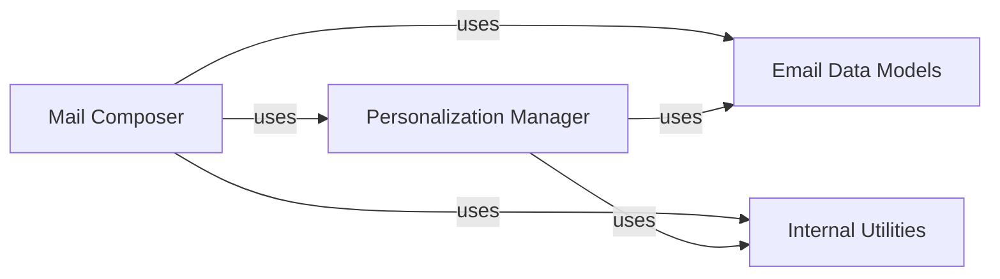

## Component Details

The Email Message Assembly subsystem is responsible for constructing a complete email message payload that adheres to SendGrid's API specifications. It manages global email attributes, handles recipient-specific personalization, and utilizes various data models to represent different parts of an email. The core flow involves a Mail Composer component that orchestrates the assembly, leveraging a Personalization Manager for recipient-specific details and a set of Email Data Models for structured data representation. Internal utility methods support the data manipulation within these main components.

### Mail Composer
This component is responsible for the overall construction and representation of an email message. It provides methods to set global email attributes like sender, subject, content, attachments, and manage personalizations. It also handles the conversion of the email object into a JSON-ready format for sending.

**Related Classes/Methods**:

- <a href="https://github.com/sendgrid/sendgrid-python/blob/master/sendgrid/helpers/mail/mail.py#L20-L1041" target="_blank" rel="noopener noreferrer">`sendgrid.helpers.mail.mail.Mail` (20:1041)</a>
- <a href="https://github.com/sendgrid/sendgrid-python/blob/master/sendgrid/helpers/mail/mail.py#L23-L81" target="_blank" rel="noopener noreferrer">`sendgrid.helpers.mail.mail.Mail:__init__` (23:81)</a>
- <a href="https://github.com/sendgrid/sendgrid-python/blob/master/sendgrid/helpers/mail/mail.py#L83-L89" target="_blank" rel="noopener noreferrer">`sendgrid.helpers.mail.mail.Mail:__str__` (83:89)</a>
- <a href="https://github.com/sendgrid/sendgrid-python/blob/master/sendgrid/helpers/mail/mail.py#L658-L663" target="_blank" rel="noopener noreferrer">`sendgrid.helpers.mail.mail.Mail:from_email` (658:663)</a>
- <a href="https://github.com/sendgrid/sendgrid-python/blob/master/sendgrid/helpers/mail/mail.py#L679-L684" target="_blank" rel="noopener noreferrer">`sendgrid.helpers.mail.mail.Mail:reply_to` (679:684)</a>
- <a href="https://github.com/sendgrid/sendgrid-python/blob/master/sendgrid/helpers/mail/mail.py#L734-L735" target="_blank" rel="noopener noreferrer">`sendgrid.helpers.mail.mail.Mail:content` (734:735)</a>
- <a href="https://github.com/sendgrid/sendgrid-python/blob/master/sendgrid/helpers/mail/mail.py#L750-L783" target="_blank" rel="noopener noreferrer">`sendgrid.helpers.mail.mail.Mail:add_content` (750:783)</a>
- <a href="https://github.com/sendgrid/sendgrid-python/blob/master/sendgrid/helpers/mail/mail.py#L794-L795" target="_blank" rel="noopener noreferrer">`sendgrid.helpers.mail.mail.Mail:attachment` (794:795)</a>
- <a href="https://github.com/sendgrid/sendgrid-python/blob/master/sendgrid/helpers/mail/mail.py#L810-L816" target="_blank" rel="noopener noreferrer">`sendgrid.helpers.mail.mail.Mail:add_attachment` (810:816)</a>
- <a href="https://github.com/sendgrid/sendgrid-python/blob/master/sendgrid/helpers/mail/mail.py#L819-L824" target="_blank" rel="noopener noreferrer">`sendgrid.helpers.mail.mail.Mail:template_id` (819:824)</a>
- <a href="https://github.com/sendgrid/sendgrid-python/blob/master/sendgrid/helpers/mail/mail.py#L847-L848" target="_blank" rel="noopener noreferrer">`sendgrid.helpers.mail.mail.Mail:section` (847:848)</a>
- <a href="https://github.com/sendgrid/sendgrid-python/blob/master/sendgrid/helpers/mail/mail.py#L862-L868" target="_blank" rel="noopener noreferrer">`sendgrid.helpers.mail.mail.Mail:add_section` (862:868)</a>
- <a href="https://github.com/sendgrid/sendgrid-python/blob/master/sendgrid/helpers/mail/mail.py#L879-L880" target="_blank" rel="noopener noreferrer">`sendgrid.helpers.mail.mail.Mail:category` (879:880)</a>
- <a href="https://github.com/sendgrid/sendgrid-python/blob/master/sendgrid/helpers/mail/mail.py#L894-L899" target="_blank" rel="noopener noreferrer">`sendgrid.helpers.mail.mail.Mail:add_category` (894:899)</a>
- <a href="https://github.com/sendgrid/sendgrid-python/blob/master/sendgrid/helpers/mail/mail.py#L986-L1015" target="_blank" rel="noopener noreferrer">`sendgrid.helpers.mail.mail.Mail:get` (986:1015)</a>
- <a href="https://github.com/sendgrid/sendgrid-python/blob/master/sendgrid/helpers/mail/mail.py#L1018-L1041" target="_blank" rel="noopener noreferrer">`sendgrid.helpers.mail.mail.Mail:from_EmailMessage` (1018:1041)</a>

### Personalization Manager
This component manages recipient-specific data within an email, allowing for different recipients to receive customized subjects, headers, substitutions, custom arguments, and send times. It orchestrates the addition and management of Personalization objects.

**Related Classes/Methods**:

- <a href="https://github.com/sendgrid/sendgrid-python/blob/master/sendgrid/helpers/mail/personalization.py#L1-L271" target="_blank" rel="noopener noreferrer">`sendgrid.helpers.mail.personalization.Personalization` (1:271)</a>
- <a href="https://github.com/sendgrid/sendgrid-python/blob/master/sendgrid/helpers/mail/mail.py#L136-L191" target="_blank" rel="noopener noreferrer">`sendgrid.helpers.mail.mail.Mail:_set_emails` (136:191)</a>
- <a href="https://github.com/sendgrid/sendgrid-python/blob/master/sendgrid/helpers/mail/mail.py#L201-L210" target="_blank" rel="noopener noreferrer">`sendgrid.helpers.mail.mail.Mail:add_personalization` (201:210)</a>
- <a href="https://github.com/sendgrid/sendgrid-python/blob/master/sendgrid/helpers/mail/mail.py#L213-L214" target="_blank" rel="noopener noreferrer">`sendgrid.helpers.mail.mail.Mail:to` (213:214)</a>
- <a href="https://github.com/sendgrid/sendgrid-python/blob/master/sendgrid/helpers/mail/mail.py#L244-L277" target="_blank" rel="noopener noreferrer">`sendgrid.helpers.mail.mail.Mail:add_to` (244:277)</a>
- <a href="https://github.com/sendgrid/sendgrid-python/blob/master/sendgrid/helpers/mail/mail.py#L280-L281" target="_blank" rel="noopener noreferrer">`sendgrid.helpers.mail.mail.Mail:cc` (280:281)</a>
- <a href="https://github.com/sendgrid/sendgrid-python/blob/master/sendgrid/helpers/mail/mail.py#L311-L332" target="_blank" rel="noopener noreferrer">`sendgrid.helpers.mail.mail.Mail:add_cc` (311:332)</a>
- <a href="https://github.com/sendgrid/sendgrid-python/blob/master/sendgrid/helpers/mail/mail.py#L335-L336" target="_blank" rel="noopener noreferrer">`sendgrid.helpers.mail.mail.Mail:bcc` (335:336)</a>
- <a href="https://github.com/sendgrid/sendgrid-python/blob/master/sendgrid/helpers/mail/mail.py#L371-L399" target="_blank" rel="noopener noreferrer">`sendgrid.helpers.mail.mail.Mail:add_bcc` (371:399)</a>
- <a href="https://github.com/sendgrid/sendgrid-python/blob/master/sendgrid/helpers/mail/mail.py#L402-L407" target="_blank" rel="noopener noreferrer">`sendgrid.helpers.mail.mail.Mail:subject` (402:407)</a>
- <a href="https://github.com/sendgrid/sendgrid-python/blob/master/sendgrid/helpers/mail/mail.py#L445-L446" target="_blank" rel="noopener noreferrer">`sendgrid.helpers.mail.mail.Mail:header` (445:446)</a>
- <a href="https://github.com/sendgrid/sendgrid-python/blob/master/sendgrid/helpers/mail/mail.py#L461-L491" target="_blank" rel="noopener noreferrer">`sendgrid.helpers.mail.mail.Mail:add_header` (461:491)</a>
- <a href="https://github.com/sendgrid/sendgrid-python/blob/master/sendgrid/helpers/mail/mail.py#L494-L495" target="_blank" rel="noopener noreferrer">`sendgrid.helpers.mail.mail.Mail:substitution` (494:495)</a>
- <a href="https://github.com/sendgrid/sendgrid-python/blob/master/sendgrid/helpers/mail/mail.py#L510-L536" target="_blank" rel="noopener noreferrer">`sendgrid.helpers.mail.mail.Mail:add_substitution` (510:536)</a>
- <a href="https://github.com/sendgrid/sendgrid-python/blob/master/sendgrid/helpers/mail/mail.py#L547-L548" target="_blank" rel="noopener noreferrer">`sendgrid.helpers.mail.mail.Mail:custom_arg` (547:548)</a>
- <a href="https://github.com/sendgrid/sendgrid-python/blob/master/sendgrid/helpers/mail/mail.py#L564-L594" target="_blank" rel="noopener noreferrer">`sendgrid.helpers.mail.mail.Mail:add_custom_arg` (564:594)</a>
- <a href="https://github.com/sendgrid/sendgrid-python/blob/master/sendgrid/helpers/mail/mail.py#L597-L602" target="_blank" rel="noopener noreferrer">`sendgrid.helpers.mail.mail.Mail:send_at` (597:602)</a>
- <a href="https://github.com/sendgrid/sendgrid-python/blob/master/sendgrid/helpers/mail/mail.py#L633-L634" target="_blank" rel="noopener noreferrer">`sendgrid.helpers.mail.mail.Mail:dynamic_template_data` (633:634)</a>
- <a href="https://github.com/sendgrid/sendgrid-python/blob/master/sendgrid/helpers/mail/personalization.py#L19-L33" target="_blank" rel="noopener noreferrer">`sendgrid.helpers.mail.personalization.Personalization:add_email` (19:33)</a>
- <a href="https://github.com/sendgrid/sendgrid-python/blob/master/sendgrid/helpers/mail/personalization.py#L50-L55" target="_blank" rel="noopener noreferrer">`sendgrid.helpers.mail.personalization.Personalization:tos` (50:55)</a>
- <a href="https://github.com/sendgrid/sendgrid-python/blob/master/sendgrid/helpers/mail/personalization.py#L61-L82" target="_blank" rel="noopener noreferrer">`sendgrid.helpers.mail.personalization.Personalization:add_to` (61:82)</a>
- <a href="https://github.com/sendgrid/sendgrid-python/blob/master/sendgrid/helpers/mail/personalization.py#L96-L101" target="_blank" rel="noopener noreferrer">`sendgrid.helpers.mail.personalization.Personalization:ccs` (96:101)</a>
- <a href="https://github.com/sendgrid/sendgrid-python/blob/master/sendgrid/helpers/mail/personalization.py#L116-L121" target="_blank" rel="noopener noreferrer">`sendgrid.helpers.mail.personalization.Personalization:bccs` (116:121)</a>

### Email Data Models
This component comprises various classes that serve as data structures for specific email attributes. These classes encapsulate the data and provide methods to retrieve their JSON representation, facilitating the construction of the overall email payload.

**Related Classes/Methods**:

- <a href="https://github.com/sendgrid/sendgrid-python/blob/master/sendgrid/helpers/mail/to_email.py#L4-L5" target="_blank" rel="noopener noreferrer">`sendgrid.helpers.mail.to_email.To` (4:5)</a>
- <a href="https://github.com/sendgrid/sendgrid-python/blob/master/sendgrid/helpers/mail/cc_email.py#L4-L5" target="_blank" rel="noopener noreferrer">`sendgrid.helpers.mail.cc_email.Cc` (4:5)</a>
- <a href="https://github.com/sendgrid/sendgrid-python/blob/master/sendgrid/helpers/mail/bcc_email.py#L4-L5" target="_blank" rel="noopener noreferrer">`sendgrid.helpers.mail.bcc_email.Bcc` (4:5)</a>
- <a href="https://github.com/sendgrid/sendgrid-python/blob/master/sendgrid/helpers/mail/content.py#L5-L81" target="_blank" rel="noopener noreferrer">`sendgrid.helpers.mail.content.Content` (5:81)</a>
- <a href="https://github.com/sendgrid/sendgrid-python/blob/master/sendgrid/helpers/mail/from_email.py#L4-L5" target="_blank" rel="noopener noreferrer">`sendgrid.helpers.mail.from_email.From` (4:5)</a>
- <a href="https://github.com/sendgrid/sendgrid-python/blob/master/sendgrid/helpers/mail/reply_to.py#L4-L5" target="_blank" rel="noopener noreferrer">`sendgrid.helpers.mail.reply_to.ReplyTo` (4:5)</a>
- <a href="https://github.com/sendgrid/sendgrid-python/blob/master/sendgrid/helpers/mail/subject.py#L1-L69" target="_blank" rel="noopener noreferrer">`sendgrid.helpers.mail.subject.Subject` (1:69)</a>
- <a href="https://github.com/sendgrid/sendgrid-python/blob/master/sendgrid/helpers/mail/header.py#L1-L94" target="_blank" rel="noopener noreferrer">`sendgrid.helpers.mail.header.Header` (1:94)</a>
- <a href="https://github.com/sendgrid/sendgrid-python/blob/master/sendgrid/helpers/mail/substitution.py#L1-L90" target="_blank" rel="noopener noreferrer">`sendgrid.helpers.mail.substitution.Substitution` (1:90)</a>
- <a href="https://github.com/sendgrid/sendgrid-python/blob/master/sendgrid/helpers/mail/custom_arg.py#L1-L94" target="_blank" rel="noopener noreferrer">`sendgrid.helpers.mail.custom_arg.CustomArg` (1:94)</a>
- <a href="https://github.com/sendgrid/sendgrid-python/blob/master/sendgrid/helpers/mail/send_at.py#L1-L79" target="_blank" rel="noopener noreferrer">`sendgrid.helpers.mail.send_at.SendAt` (1:79)</a>
- <a href="https://github.com/sendgrid/sendgrid-python/blob/master/sendgrid/helpers/mail/dynamic_template_data.py#L1-L73" target="_blank" rel="noopener noreferrer">`sendgrid.helpers.mail.dynamic_template_data.DynamicTemplateData` (1:73)</a>
- <a href="https://github.com/sendgrid/sendgrid-python/blob/master/sendgrid/helpers/mail/template_id.py#L1-L39" target="_blank" rel="noopener noreferrer">`sendgrid.helpers.mail.template_id.TemplateId` (1:39)</a>
- <a href="https://github.com/sendgrid/sendgrid-python/blob/master/sendgrid/helpers/mail/email.py#L13-L228" target="_blank" rel="noopener noreferrer">`sendgrid.helpers.mail.email.Email` (13:228)</a>
- <a href="https://github.com/sendgrid/sendgrid-python/blob/master/sendgrid/helpers/mail/dynamic_template_data.py#L59-L64" target="_blank" rel="noopener noreferrer">`sendgrid.helpers.mail.dynamic_template_data.DynamicTemplateData:__str__` (59:64)</a>
- <a href="https://github.com/sendgrid/sendgrid-python/blob/master/sendgrid/helpers/mail/dynamic_template_data.py#L66-L73" target="_blank" rel="noopener noreferrer">`sendgrid.helpers.mail.dynamic_template_data.DynamicTemplateData.get` (66:73)</a>
- <a href="https://github.com/sendgrid/sendgrid-python/blob/master/sendgrid/helpers/mail/send_at.py#L65-L70" target="_blank" rel="noopener noreferrer">`sendgrid.helpers.mail.send_at.SendAt:__str__` (65:70)</a>
- <a href="https://github.com/sendgrid/sendgrid-python/blob/master/sendgrid/helpers/mail/send_at.py#L72-L79" target="_blank" rel="noopener noreferrer">`sendgrid.helpers.mail.send_at.SendAt.get` (72:79)</a>
- <a href="https://github.com/sendgrid/sendgrid-python/blob/master/sendgrid/helpers/mail/email.py#L16-L60" target="_blank" rel="noopener noreferrer">`sendgrid.helpers.mail.email.Email:__init__` (16:60)</a>

### Internal Utilities
This component consists of private helper methods within the Mail and Personalization classes that provide common functionalities like ensuring items are appended or inserted into lists, flattening dictionaries, and safely retrieving JSON representations of objects. These are internal to the Mail class's operation.

**Related Classes/Methods**:

- <a href="https://github.com/sendgrid/sendgrid-python/blob/master/sendgrid/helpers/mail/mail.py#L91-L103" target="_blank" rel="noopener noreferrer">`sendgrid.helpers.mail.mail.Mail._ensure_append` (91:103)</a>
- <a href="https://github.com/sendgrid/sendgrid-python/blob/master/sendgrid/helpers/mail/mail.py#L105-L115" target="_blank" rel="noopener noreferrer">`sendgrid.helpers.mail.mail.Mail._ensure_insert` (105:115)</a>
- <a href="https://github.com/sendgrid/sendgrid-python/blob/master/sendgrid/helpers/mail/mail.py#L117-L125" target="_blank" rel="noopener noreferrer">`sendgrid.helpers.mail.mail.Mail._flatten_dicts` (117:125)</a>
- <a href="https://github.com/sendgrid/sendgrid-python/blob/master/sendgrid/helpers/mail/mail.py#L127-L134" target="_blank" rel="noopener noreferrer">`sendgrid.helpers.mail.mail.Mail._get_or_none` (127:134)</a>
- <a href="https://github.com/sendgrid/sendgrid-python/blob/master/sendgrid/helpers/mail/personalization.py#L35-L46" target="_blank" rel="noopener noreferrer">`sendgrid.helpers.mail.personalization.Personalization._get_unique_recipients` (35:46)</a>

### [FAQ](https://github.com/CodeBoarding/GeneratedOnBoardings/tree/main?tab=readme-ov-file#faq)