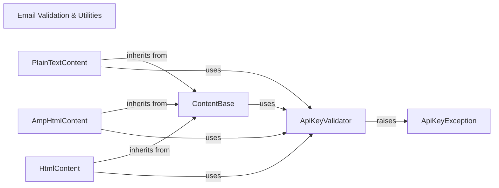

## Component Details

This system provides robust email content validation, primarily focusing on preventing the accidental inclusion of SendGrid API keys within email messages. It defines a base structure for various email content types (plain text, HTML, AMP HTML) and integrates a dedicated API key validation mechanism. The system ensures that all content, regardless of its type, is scanned for sensitive information before being processed, and raises a specific exception if an API key is detected, thereby enhancing security.

### Email Validation & Utilities
Provides utility functions for validating email message components, particularly to prevent sensitive information like API keys from being included in email content, and defines related exceptions.

**Related Classes/Methods**:

- <a href="https://github.com/sendgrid/sendgrid-python/blob/master/sendgrid/helpers/mail/validators.py#L4-L69" target="_blank" rel="noopener noreferrer">`sendgrid.helpers.mail.validators.ValidateApiKey` (4:69)</a>
- <a href="https://github.com/sendgrid/sendgrid-python/blob/master/sendgrid/helpers/mail/exceptions.py#L11-L65" target="_blank" rel="noopener noreferrer">`sendgrid.helpers.mail.exceptions.ApiKeyIncludedException` (11:65)</a>
- <a href="https://github.com/sendgrid/sendgrid-python/blob/master/sendgrid/helpers/mail/mime_type.py#L1-L6" target="_blank" rel="noopener noreferrer">`sendgrid.helpers.mail.mime_type.MimeType` (1:6)</a>

### ContentBase
Provides the foundational structure and properties for various email content types, including MIME type and content value. It also integrates with the API key validation mechanism.

**Related Classes/Methods**:

- <a href="https://github.com/sendgrid/sendgrid-python/blob/master/sendgrid/helpers/mail/content.py#L5-L81" target="_blank" rel="noopener noreferrer">`sendgrid.helpers.mail.content.Content` (5:81)</a>
- <a href="https://github.com/sendgrid/sendgrid-python/blob/master/sendgrid/helpers/mail/content.py#L11-L27" target="_blank" rel="noopener noreferrer">`sendgrid.helpers.mail.content.Content:__init__` (11:27)</a>
- <a href="https://github.com/sendgrid/sendgrid-python/blob/master/sendgrid/helpers/mail/content.py#L51-L56" target="_blank" rel="noopener noreferrer">`sendgrid.helpers.mail.content.Content:content` (51:56)</a>

### PlainTextContent
Represents plain text email content, inheriting from the ContentBase. It ensures that plain text content is validated for API keys before being set.

**Related Classes/Methods**:

- <a href="https://github.com/sendgrid/sendgrid-python/blob/master/sendgrid/helpers/mail/plain_text_content.py#L5-L60" target="_blank" rel="noopener noreferrer">`sendgrid.helpers.mail.plain_text_content.PlainTextContent` (5:60)</a>
- <a href="https://github.com/sendgrid/sendgrid-python/blob/master/sendgrid/helpers/mail/plain_text_content.py#L9-L19" target="_blank" rel="noopener noreferrer">`sendgrid.helpers.mail.plain_text_content.PlainTextContent:__init__` (9:19)</a>
- <a href="https://github.com/sendgrid/sendgrid-python/blob/master/sendgrid/helpers/mail/plain_text_content.py#L30-L35" target="_blank" rel="noopener noreferrer">`sendgrid.helpers.mail.plain_text_content.PlainTextContent:content` (30:35)</a>

### AmpHtmlContent
Represents AMP HTML email content, inheriting from the ContentBase. It validates AMP HTML content for API keys.

**Related Classes/Methods**:

- <a href="https://github.com/sendgrid/sendgrid-python/blob/master/sendgrid/helpers/mail/amp_html_content.py#L5-L59" target="_blank" rel="noopener noreferrer">`sendgrid.helpers.mail.amp_html_content.AmpHtmlContent` (5:59)</a>
- <a href="https://github.com/sendgrid/sendgrid-python/blob/master/sendgrid/helpers/mail/amp_html_content.py#L8-L18" target="_blank" rel="noopener noreferrer">`sendgrid.helpers.mail.amp_html_content.AmpHtmlContent:__init__` (8:18)</a>
- <a href="https://github.com/sendgrid/sendgrid-python/blob/master/sendgrid/helpers/mail/amp_html_content.py#L29-L34" target="_blank" rel="noopener noreferrer">`sendgrid.helpers.mail.amp_html_content.AmpHtmlContent:content` (29:34)</a>

### HtmlContent
Represents standard HTML email content, inheriting from the ContentBase. It validates HTML content for API keys.

**Related Classes/Methods**:

- <a href="https://github.com/sendgrid/sendgrid-python/blob/master/sendgrid/helpers/mail/html_content.py#L5-L59" target="_blank" rel="noopener noreferrer">`sendgrid.helpers.mail.html_content.HtmlContent` (5:59)</a>
- <a href="https://github.com/sendgrid/sendgrid-python/blob/master/sendgrid/helpers/mail/html_content.py#L8-L18" target="_blank" rel="noopener noreferrer">`sendgrid.helpers.mail.html_content.HtmlContent:__init__` (8:18)</a>
- <a href="https://github.com/sendgrid/sendgrid-python/blob/master/sendgrid/helpers/mail/html_content.py#L29-L34" target="_blank" rel="noopener noreferrer">`sendgrid.helpers.mail.html_content.HtmlContent:content` (29:34)</a>

### ApiKeyValidator
Responsible for scanning email content (both dictionary and string formats) to detect and prevent the accidental inclusion of SendGrid API keys, raising an exception if found.

**Related Classes/Methods**:

- <a href="https://github.com/sendgrid/sendgrid-python/blob/master/sendgrid/helpers/mail/validators.py#L4-L69" target="_blank" rel="noopener noreferrer">`sendgrid.helpers.mail.validators.ValidateApiKey` (4:69)</a>
- <a href="https://github.com/sendgrid/sendgrid-python/blob/master/sendgrid/helpers/mail/validators.py#L30-L55" target="_blank" rel="noopener noreferrer">`sendgrid.helpers.mail.validators.ValidateApiKey:validate_message_dict` (30:55)</a>
- <a href="https://github.com/sendgrid/sendgrid-python/blob/master/sendgrid/helpers/mail/validators.py#L57-L69" target="_blank" rel="noopener noreferrer">`sendgrid.helpers.mail.validators.ValidateApiKey:validate_message_text` (57:69)</a>

### ApiKeyException
Defines the specific exception raised when a SendGrid API key is detected within the email content during validation.

**Related Classes/Methods**:

- <a href="https://github.com/sendgrid/sendgrid-python/blob/master/sendgrid/helpers/mail/exceptions.py#L11-L65" target="_blank" rel="noopener noreferrer">`sendgrid.helpers.mail.exceptions.ApiKeyIncludedException` (11:65)</a>

### [FAQ](https://github.com/CodeBoarding/GeneratedOnBoardings/tree/main?tab=readme-ov-file#faq)