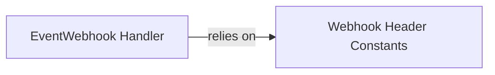

## Component Details

This subsystem is responsible for handling incoming SendGrid event webhooks. Its primary function is to verify the authenticity of these webhooks by converting public keys to ECDSA format and using predefined header constants for signature and timestamp validation, ensuring that only legitimate event data is processed.

### EventWebhook Handler
Manages the processing of SendGrid event webhooks, including the necessary public key conversion for signature verification to ensure webhook authenticity.

**Related Classes/Methods**:

- `sendgrid.helpers.eventwebhook.EventWebhook` (full file reference)
- `sendgrid.helpers.eventwebhook.EventWebhook:__init__` (full file reference)
- `sendgrid.helpers.eventwebhook.EventWebhook.convert_public_key_to_ecdsa` (full file reference)

### Webhook Header Constants
Defines constant string values for HTTP headers expected in SendGrid event webhooks, such as the signature and timestamp headers. These constants are used by other components, like the EventWebhook Handler, to correctly identify and extract information from webhook requests.

**Related Classes/Methods**:

- <a href="https://github.com/sendgrid/sendgrid-python/blob/master/sendgrid/helpers/eventwebhook/eventwebhook_header.py#L1-L10" target="_blank" rel="noopener noreferrer">`sendgrid.helpers.eventwebhook.eventwebhook_header.EventWebhookHeader` (1:10)</a>

### [FAQ](https://github.com/CodeBoarding/GeneratedOnBoardings/tree/main?tab=readme-ov-file#faq)