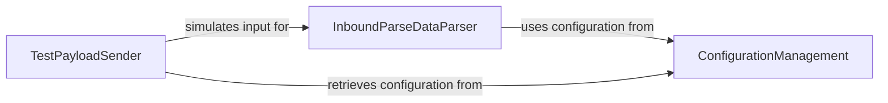

## Component Details

The Inbound Email Processing subsystem is designed to handle and parse incoming emails received via SendGrid's Inbound Parse webhook. It leverages a Configuration Management component to load necessary settings, such as parsing keys and environment variables. The core parsing functionality is provided by the Inbound Parse Data Parser, which extracts key-value pairs and decodes attachments from the incoming payload. A Test Payload Sender component is also included to facilitate the simulation of inbound parse webhooks for testing purposes, utilizing the same configuration settings.

### InboundParseDataParser
This component is responsible for parsing incoming data from SendGrid's Inbound Parse webhook. It extracts key-value pairs from the payload and specifically handles the extraction and decoding of attachments, supporting both standard multipart form data and raw email formats.

**Related Classes/Methods**:

- <a href="https://github.com/sendgrid/sendgrid-python/blob/master/sendgrid/helpers/inbound/parse.py#L9-L100" target="_blank" rel="noopener noreferrer">`sendgrid.helpers.inbound.parse.Parse` (9:100)</a>
- <a href="https://github.com/sendgrid/sendgrid-python/blob/master/sendgrid/helpers/inbound/parse.py#L40-L52" target="_blank" rel="noopener noreferrer">`sendgrid.helpers.inbound.parse.Parse:attachments` (40:52)</a>
- <a href="https://github.com/sendgrid/sendgrid-python/blob/master/sendgrid/helpers/inbound/parse.py#L54-L64" target="_blank" rel="noopener noreferrer">`sendgrid.helpers.inbound.parse.Parse._get_attachments` (54:64)</a>
- <a href="https://github.com/sendgrid/sendgrid-python/blob/master/sendgrid/helpers/inbound/parse.py#L29-L38" target="_blank" rel="noopener noreferrer">`sendgrid.helpers.inbound.parse.Parse.get_raw_email` (29:38)</a>
- <a href="https://github.com/sendgrid/sendgrid-python/blob/master/sendgrid/helpers/inbound/parse.py#L66-L84" target="_blank" rel="noopener noreferrer">`sendgrid.helpers.inbound.parse.Parse._get_attachments_raw` (66:84)</a>

### ConfigurationManagement
This component is responsible for loading configuration settings for the application. It initializes environment variables from a .env file and loads application-specific settings from config.yml, providing access to properties like debug mode, endpoint, host, keys, and port.

**Related Classes/Methods**:

- <a href="https://github.com/sendgrid/sendgrid-python/blob/master/sendgrid/helpers/inbound/config.py#L6-L65" target="_blank" rel="noopener noreferrer">`sendgrid.helpers.inbound.config.Config` (6:65)</a>
- <a href="https://github.com/sendgrid/sendgrid-python/blob/master/sendgrid/helpers/inbound/config.py#L9-L24" target="_blank" rel="noopener noreferrer">`sendgrid.helpers.inbound.config.Config:__init__` (9:24)</a>
- <a href="https://github.com/sendgrid/sendgrid-python/blob/master/sendgrid/helpers/inbound/config.py#L27-L38" target="_blank" rel="noopener noreferrer">`sendgrid.helpers.inbound.config.Config.init_environment` (27:38)</a>

### TestPayloadSender
This component facilitates sending test payloads to a specified URL, simulating an inbound parse webhook. It handles the creation of HTTP requests with appropriate headers and data, and reports the response status, headers, and body.

**Related Classes/Methods**:

- <a href="https://github.com/sendgrid/sendgrid-python/blob/master/sendgrid/helpers/inbound/send.py#L14-L38" target="_blank" rel="noopener noreferrer">`sendgrid.helpers.inbound.send.Send` (14:38)</a>
- <a href="https://github.com/sendgrid/sendgrid-python/blob/master/sendgrid/helpers/inbound/send.py#L41-L57" target="_blank" rel="noopener noreferrer">`sendgrid.helpers.inbound.send:main` (41:57)</a>
- <a href="https://github.com/sendgrid/sendgrid-python/blob/master/sendgrid/helpers/inbound/send.py#L20-L33" target="_blank" rel="noopener noreferrer">`sendgrid.helpers.inbound.send.Send.test_payload` (20:33)</a>

### [FAQ](https://github.com/CodeBoarding/GeneratedOnBoardings/tree/main?tab=readme-ov-file#faq)