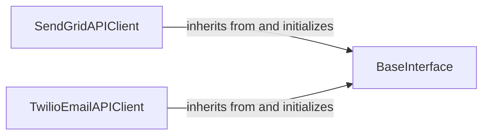

## Component Details

This subsystem provides the core functionality for interacting with the SendGrid and Twilio Email APIs. It consists of a base interface that handles common HTTP request logic and authentication, and two specialized client classes that inherit from this base to provide specific API interactions for SendGrid and Twilio Email services. The main flow involves initializing a client with appropriate credentials, constructing an email message, and then using the client's `send` method to dispatch the email via the respective API.

### SendGridAPIClient
The SendGridAPIClient component is the main entry point for interacting with the Twilio SendGrid Web API v3. It is responsible for initializing the API client with an API key and setting up the necessary authentication for API calls. This component extends the BaseInterface to leverage common API interaction functionalities.

**Related Classes/Methods**:

- <a href="https://github.com/sendgrid/sendgrid-python/blob/master/sendgrid/sendgrid.py#L19-L58" target="_blank" rel="noopener noreferrer">`sendgrid.sendgrid.SendGridAPIClient` (19:58)</a>
- <a href="https://github.com/sendgrid/sendgrid-python/blob/master/sendgrid/sendgrid.py#L32-L58" target="_blank" rel="noopener noreferrer">`sendgrid.sendgrid.SendGridAPIClient.__init__` (32:58)</a>

### TwilioEmailAPIClient
The TwilioEmailAPIClient component provides an interface for the Twilio Email Web API v3. It handles authentication using a username and password (API key SID/Account SID and secret/Auth Token) and initializes the underlying HTTP client. Similar to SendGridAPIClient, it extends BaseInterface for shared API communication logic.

**Related Classes/Methods**:

- <a href="https://github.com/sendgrid/sendgrid-python/blob/master/sendgrid/twilio_email.py#L19-L73" target="_blank" rel="noopener noreferrer">`sendgrid.twilio_email.TwilioEmailAPIClient` (19:73)</a>
- <a href="https://github.com/sendgrid/sendgrid-python/blob/master/sendgrid/twilio_email.py#L33-L73" target="_blank" rel="noopener noreferrer">`sendgrid.twilio_email.TwilioEmailAPIClient.__init__` (33:73)</a>

### BaseInterface
The BaseInterface component serves as the abstract foundation for all API clients within the sendgrid-python library. It encapsulates the core logic for making HTTP requests, managing authentication headers, and interacting with the underlying 'python_http_client' library. It provides common functionalities like sending messages and setting data residency, which are inherited and utilized by specific API client implementations.

**Related Classes/Methods**:

- <a href="https://github.com/sendgrid/sendgrid-python/blob/master/sendgrid/base_interface.py#L5-L83" target="_blank" rel="noopener noreferrer">`sendgrid.base_interface.BaseInterface` (5:83)</a>
- <a href="https://github.com/sendgrid/sendgrid-python/blob/master/sendgrid/base_interface.py#L6-L34" target="_blank" rel="noopener noreferrer">`sendgrid.base_interface.BaseInterface.__init__` (6:34)</a>
- <a href="https://github.com/sendgrid/sendgrid-python/blob/master/sendgrid/base_interface.py#L37-L47" target="_blank" rel="noopener noreferrer">`sendgrid.base_interface.BaseInterface._default_headers` (37:47)</a>
- <a href="https://github.com/sendgrid/sendgrid-python/blob/master/sendgrid/base_interface.py#L49-L50" target="_blank" rel="noopener noreferrer">`sendgrid.base_interface.BaseInterface.reset_request_headers` (49:50)</a>
- <a href="https://github.com/sendgrid/sendgrid-python/blob/master/sendgrid/base_interface.py#L52-L63" target="_blank" rel="noopener noreferrer">`sendgrid.base_interface.BaseInterface.send` (52:63)</a>
- <a href="https://github.com/sendgrid/sendgrid-python/blob/master/sendgrid/base_interface.py#L65-L83" target="_blank" rel="noopener noreferrer">`sendgrid.base_interface.BaseInterface.set_sendgrid_data_residency` (65:83)</a>

### [FAQ](https://github.com/CodeBoarding/GeneratedOnBoardings/tree/main?tab=readme-ov-file#faq)