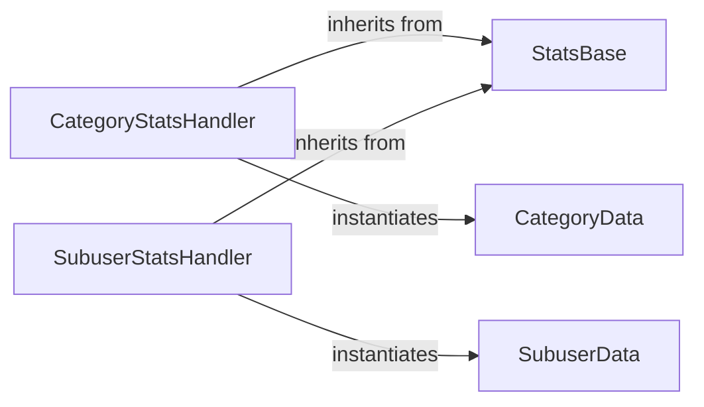

## Component Details

The Statistics & Analytics Management subsystem provides a structured way to retrieve and manage various email statistics from the SendGrid API. It defines a base component for general statistics queries and extends it for category-specific and subuser-specific statistics. Auxiliary components represent the data entities for categories and subusers, facilitating the construction of API requests.

### StatsBase
This component provides the foundational structure and methods for handling general email statistics queries. It includes properties for start_date, end_date, aggregated_by, sort_by_metric, sort_by_direction, limit, and offset, allowing for flexible data retrieval. Its get method prepares these parameters into a JSON-ready dictionary.

**Related Classes/Methods**:

- <a href="https://github.com/sendgrid/sendgrid-python/blob/master/sendgrid/helpers/stats/stats.py#L1-L172" target="_blank" rel="noopener noreferrer">`sendgrid.helpers.stats.stats.Stats` (1:172)</a>
- <a href="https://github.com/sendgrid/sendgrid-python/blob/master/sendgrid/helpers/stats/stats.py#L24-L29" target="_blank" rel="noopener noreferrer">`sendgrid.helpers.stats.stats.Stats:__str__` (24:29)</a>
- <a href="https://github.com/sendgrid/sendgrid-python/blob/master/sendgrid/helpers/stats/stats.py#L31-L53" target="_blank" rel="noopener noreferrer">`sendgrid.helpers.stats.stats.Stats.get` (31:53)</a>

### CategoryStatsHandler
This component extends the StatsBase to handle statistics specific to email categories. It manages a list of Category objects and provides functionality to add new categories, preparing category-specific query parameters.

**Related Classes/Methods**:

- <a href="https://github.com/sendgrid/sendgrid-python/blob/master/sendgrid/helpers/stats/stats.py#L175-L238" target="_blank" rel="noopener noreferrer">`sendgrid.helpers.stats.stats.CategoryStats` (175:238)</a>
- <a href="https://github.com/sendgrid/sendgrid-python/blob/master/sendgrid/helpers/stats/stats.py#L179-L194" target="_blank" rel="noopener noreferrer">`sendgrid.helpers.stats.stats.CategoryStats:__init__` (179:194)</a>
- <a href="https://github.com/sendgrid/sendgrid-python/blob/master/sendgrid/helpers/stats/stats.py#L230-L238" target="_blank" rel="noopener noreferrer">`sendgrid.helpers.stats.stats.CategoryStats.add_category` (230:238)</a>

### SubuserStatsHandler
This component extends the StatsBase to manage statistics related to subusers. It handles a list of Subuser objects and provides methods to add new subusers, preparing subuser-specific query parameters.

**Related Classes/Methods**:

- <a href="https://github.com/sendgrid/sendgrid-python/blob/master/sendgrid/helpers/stats/stats.py#L241-L304" target="_blank" rel="noopener noreferrer">`sendgrid.helpers.stats.stats.SubuserStats` (241:304)</a>
- <a href="https://github.com/sendgrid/sendgrid-python/blob/master/sendgrid/helpers/stats/stats.py#L245-L260" target="_blank" rel="noopener noreferrer">`sendgrid.helpers.stats.stats.SubuserStats:__init__` (245:260)</a>
- <a href="https://github.com/sendgrid/sendgrid-python/blob/master/sendgrid/helpers/stats/stats.py#L296-L304" target="_blank" rel="noopener noreferrer">`sendgrid.helpers.stats.stats.SubuserStats.add_subuser` (296:304)</a>

### CategoryData
This component represents a single email category used for statistics. It primarily holds the name of the category and provides a method to retrieve this name.

**Related Classes/Methods**:

- <a href="https://github.com/sendgrid/sendgrid-python/blob/master/sendgrid/helpers/stats/stats.py#L307-L344" target="_blank" rel="noopener noreferrer">`sendgrid.helpers.stats.stats.Category` (307:344)</a>

### SubuserData
This component represents a single subuser used for statistics. It primarily holds the name of the subuser and provides a method to retrieve this name.

**Related Classes/Methods**:

- <a href="https://github.com/sendgrid/sendgrid-python/blob/master/sendgrid/helpers/stats/stats.py#L347-L384" target="_blank" rel="noopener noreferrer">`sendgrid.helpers.stats.stats.Subuser` (347:384)</a>

### [FAQ](https://github.com/CodeBoarding/GeneratedOnBoardings/tree/main?tab=readme-ov-file#faq)