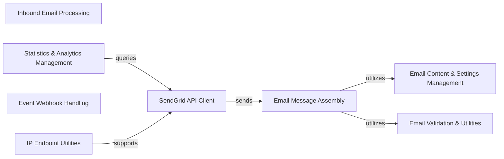

## Component Details

This graph represents the high-level architecture of the `sendgrid-python` library, primarily focusing on its core functionality of email sending and related utilities. The main flow involves constructing an email message using various helper components, which is then sent via the central SendGrid API Client. Additionally, the library provides functionalities for handling inbound emails, processing event webhooks, and retrieving statistics.

### SendGrid API Client
Provides the primary interface for interacting with the SendGrid Web API v3, enabling the sending of emails and other API operations. It acts as the central communication hub with the SendGrid service.

**Related Classes/Methods**:

- <a href="https://github.com/sendgrid/sendgrid-python/blob/master/sendgrid/sendgrid.py#L19-L58" target="_blank" rel="noopener noreferrer">`sendgrid.sendgrid.SendGridAPIClient` (19:58)</a>
- `sendgrid.sendgrid.twilio_email.TwilioEmailAPIClient` (full file reference)
- `sendgrid.sendgrid.base_interface.BaseInterface` (full file reference)

### Email Message Assembly
Responsible for constructing a complete email message payload, including managing recipients, personalization, and overall message structure according to SendGrid's API specifications.

**Related Classes/Methods**:

- <a href="https://github.com/sendgrid/sendgrid-python/blob/master/sendgrid/helpers/mail/mail.py#L20-L1041" target="_blank" rel="noopener noreferrer">`sendgrid.helpers.mail.mail.Mail` (20:1041)</a>
- <a href="https://github.com/sendgrid/sendgrid-python/blob/master/sendgrid/helpers/mail/personalization.py#L1-L271" target="_blank" rel="noopener noreferrer">`sendgrid.helpers.mail.personalization.Personalization` (1:271)</a>
- <a href="https://github.com/sendgrid/sendgrid-python/blob/master/sendgrid/helpers/mail/to_email.py#L4-L5" target="_blank" rel="noopener noreferrer">`sendgrid.helpers.mail.to_email.To` (4:5)</a>
- <a href="https://github.com/sendgrid/sendgrid-python/blob/master/sendgrid/helpers/mail/cc_email.py#L4-L5" target="_blank" rel="noopener noreferrer">`sendgrid.helpers.mail.cc_email.Cc` (4:5)</a>
- <a href="https://github.com/sendgrid/sendgrid-python/blob/master/sendgrid/helpers/mail/bcc_email.py#L4-L5" target="_blank" rel="noopener noreferrer">`sendgrid.helpers.mail.bcc_email.Bcc` (4:5)</a>
- <a href="https://github.com/sendgrid/sendgrid-python/blob/master/sendgrid/helpers/mail/email.py#L13-L228" target="_blank" rel="noopener noreferrer">`sendgrid.helpers.mail.email.Email` (13:228)</a>
- <a href="https://github.com/sendgrid/sendgrid-python/blob/master/sendgrid/helpers/mail/custom_arg.py#L1-L94" target="_blank" rel="noopener noreferrer">`sendgrid.helpers.mail.custom_arg.CustomArg` (1:94)</a>
- <a href="https://github.com/sendgrid/sendgrid-python/blob/master/sendgrid/helpers/mail/substitution.py#L1-L90" target="_blank" rel="noopener noreferrer">`sendgrid.helpers.mail.substitution.Substitution` (1:90)</a>
- <a href="https://github.com/sendgrid/sendgrid-python/blob/master/sendgrid/helpers/mail/send_at.py#L1-L79" target="_blank" rel="noopener noreferrer">`sendgrid.helpers.mail.send_at.SendAt` (1:79)</a>
- <a href="https://github.com/sendgrid/sendgrid-python/blob/master/sendgrid/helpers/mail/dynamic_template_data.py#L1-L73" target="_blank" rel="noopener noreferrer">`sendgrid.helpers.mail.dynamic_template_data.DynamicTemplateData` (1:73)</a>

### Email Content & Settings Management
Handles the various types of email content (plain text, HTML, AMP HTML), attachments, and global email settings such as sender/reply-to addresses, subject, headers, template IDs, categories, and tracking options.

**Related Classes/Methods**:

- <a href="https://github.com/sendgrid/sendgrid-python/blob/master/sendgrid/helpers/mail/content.py#L5-L81" target="_blank" rel="noopener noreferrer">`sendgrid.helpers.mail.content.Content` (5:81)</a>
- <a href="https://github.com/sendgrid/sendgrid-python/blob/master/sendgrid/helpers/mail/plain_text_content.py#L5-L60" target="_blank" rel="noopener noreferrer">`sendgrid.helpers.mail.plain_text_content.PlainTextContent` (5:60)</a>
- <a href="https://github.com/sendgrid/sendgrid-python/blob/master/sendgrid/helpers/mail/html_content.py#L5-L59" target="_blank" rel="noopener noreferrer">`sendgrid.helpers.mail.html_content.HtmlContent` (5:59)</a>
- <a href="https://github.com/sendgrid/sendgrid-python/blob/master/sendgrid/helpers/mail/amp_html_content.py#L5-L59" target="_blank" rel="noopener noreferrer">`sendgrid.helpers.mail.amp_html_content.AmpHtmlContent` (5:59)</a>
- <a href="https://github.com/sendgrid/sendgrid-python/blob/master/sendgrid/helpers/mail/attachment.py#L8-L218" target="_blank" rel="noopener noreferrer">`sendgrid.helpers.mail.attachment.Attachment` (8:218)</a>
- <a href="https://github.com/sendgrid/sendgrid-python/blob/master/sendgrid/helpers/mail/content_id.py#L1-L50" target="_blank" rel="noopener noreferrer">`sendgrid.helpers.mail.content_id.ContentId` (1:50)</a>
- <a href="https://github.com/sendgrid/sendgrid-python/blob/master/sendgrid/helpers/mail/disposition.py#L1-L72" target="_blank" rel="noopener noreferrer">`sendgrid.helpers.mail.disposition.Disposition` (1:72)</a>
- <a href="https://github.com/sendgrid/sendgrid-python/blob/master/sendgrid/helpers/mail/file_content.py#L1-L39" target="_blank" rel="noopener noreferrer">`sendgrid.helpers.mail.file_content.FileContent` (1:39)</a>
- <a href="https://github.com/sendgrid/sendgrid-python/blob/master/sendgrid/helpers/mail/file_name.py#L1-L39" target="_blank" rel="noopener noreferrer">`sendgrid.helpers.mail.file_name.FileName` (1:39)</a>
- <a href="https://github.com/sendgrid/sendgrid-python/blob/master/sendgrid/helpers/mail/file_type.py#L1-L39" target="_blank" rel="noopener noreferrer">`sendgrid.helpers.mail.file_type.FileType` (1:39)</a>
- <a href="https://github.com/sendgrid/sendgrid-python/blob/master/sendgrid/helpers/mail/subject.py#L1-L69" target="_blank" rel="noopener noreferrer">`sendgrid.helpers.mail.subject.Subject` (1:69)</a>
- <a href="https://github.com/sendgrid/sendgrid-python/blob/master/sendgrid/helpers/mail/header.py#L1-L94" target="_blank" rel="noopener noreferrer">`sendgrid.helpers.mail.header.Header` (1:94)</a>
- <a href="https://github.com/sendgrid/sendgrid-python/blob/master/sendgrid/helpers/mail/from_email.py#L4-L5" target="_blank" rel="noopener noreferrer">`sendgrid.helpers.mail.from_email.From` (4:5)</a>
- <a href="https://github.com/sendgrid/sendgrid-python/blob/master/sendgrid/helpers/mail/reply_to.py#L4-L5" target="_blank" rel="noopener noreferrer">`sendgrid.helpers.mail.reply_to.ReplyTo` (4:5)</a>
- <a href="https://github.com/sendgrid/sendgrid-python/blob/master/sendgrid/helpers/mail/template_id.py#L1-L39" target="_blank" rel="noopener noreferrer">`sendgrid.helpers.mail.template_id.TemplateId` (1:39)</a>
- <a href="https://github.com/sendgrid/sendgrid-python/blob/master/sendgrid/helpers/mail/section.py#L1-L64" target="_blank" rel="noopener noreferrer">`sendgrid.helpers.mail.section.Section` (1:64)</a>
- <a href="https://github.com/sendgrid/sendgrid-python/blob/master/sendgrid/helpers/mail/category.py#L1-L40" target="_blank" rel="noopener noreferrer">`sendgrid.helpers.mail.category.Category` (1:40)</a>
- <a href="https://github.com/sendgrid/sendgrid-python/blob/master/sendgrid/helpers/mail/ganalytics.py#L1-L176" target="_blank" rel="noopener noreferrer">`sendgrid.helpers.mail.ganalytics.Ganalytics` (1:176)</a>
- <a href="https://github.com/sendgrid/sendgrid-python/blob/master/sendgrid/helpers/mail/batch_id.py#L1-L50" target="_blank" rel="noopener noreferrer">`sendgrid.helpers.mail.batch_id.BatchId` (1:50)</a>
- <a href="https://github.com/sendgrid/sendgrid-python/blob/master/sendgrid/helpers/mail/asm.py#L5-L80" target="_blank" rel="noopener noreferrer">`sendgrid.helpers.mail.asm.Asm` (5:80)</a>
- <a href="https://github.com/sendgrid/sendgrid-python/blob/master/sendgrid/helpers/mail/spam_check.py#L5-L112" target="_blank" rel="noopener noreferrer">`sendgrid.helpers.mail.spam_check.SpamCheck` (5:112)</a>
- <a href="https://github.com/sendgrid/sendgrid-python/blob/master/sendgrid/helpers/mail/spam_threshold.py#L1-L53" target="_blank" rel="noopener noreferrer">`sendgrid.helpers.mail.spam_threshold.SpamThreshold` (1:53)</a>
- <a href="https://github.com/sendgrid/sendgrid-python/blob/master/sendgrid/helpers/mail/spam_url.py#L1-L44" target="_blank" rel="noopener noreferrer">`sendgrid.helpers.mail.spam_url.SpamUrl` (1:44)</a>
- <a href="https://github.com/sendgrid/sendgrid-python/blob/master/sendgrid/helpers/mail/ip_pool_name.py#L1-L40" target="_blank" rel="noopener noreferrer">`sendgrid.helpers.mail.ip_pool_name.IpPoolName` (1:40)</a>
- <a href="https://github.com/sendgrid/sendgrid-python/blob/master/sendgrid/helpers/mail/mail_settings.py#L1-L243" target="_blank" rel="noopener noreferrer">`sendgrid.helpers.mail.mail_settings.MailSettings` (1:243)</a>
- <a href="https://github.com/sendgrid/sendgrid-python/blob/master/sendgrid/helpers/mail/tracking_settings.py#L1-L134" target="_blank" rel="noopener noreferrer">`sendgrid.helpers.mail.tracking_settings.TrackingSettings` (1:134)</a>

### Email Validation & Utilities
Provides utility functions for validating email message components, particularly to prevent sensitive information like API keys from being included in email content, and defines related exceptions.

**Related Classes/Methods**:

- <a href="https://github.com/sendgrid/sendgrid-python/blob/master/sendgrid/helpers/mail/validators.py#L4-L69" target="_blank" rel="noopener noreferrer">`sendgrid.helpers.mail.validators.ValidateApiKey` (4:69)</a>
- <a href="https://github.com/sendgrid/sendgrid-python/blob/master/sendgrid/helpers/mail/exceptions.py#L11-L65" target="_blank" rel="noopener noreferrer">`sendgrid.helpers.mail.exceptions.ApiKeyIncludedException` (11:65)</a>
- <a href="https://github.com/sendgrid/sendgrid-python/blob/master/sendgrid/helpers/mail/mime_type.py#L1-L6" target="_blank" rel="noopener noreferrer">`sendgrid.helpers.mail.mime_type.MimeType` (1:6)</a>

### Inbound Email Processing
Dedicated component for parsing and configuring inbound emails received by SendGrid, including attachment extraction and environment-specific settings.

**Related Classes/Methods**:

- <a href="https://github.com/sendgrid/sendgrid-python/blob/master/sendgrid/helpers/inbound/parse.py#L9-L100" target="_blank" rel="noopener noreferrer">`sendgrid.helpers.inbound.parse.Parse` (9:100)</a>
- <a href="https://github.com/sendgrid/sendgrid-python/blob/master/sendgrid/helpers/inbound/config.py#L6-L65" target="_blank" rel="noopener noreferrer">`sendgrid.helpers.inbound.config.Config` (6:65)</a>
- <a href="https://github.com/sendgrid/sendgrid-python/blob/master/sendgrid/helpers/inbound/send.py#L14-L38" target="_blank" rel="noopener noreferrer">`sendgrid.helpers.inbound.send.Send` (14:38)</a>

### Statistics & Analytics Management
Provides functionality to retrieve and manage various email statistics, including general, category-specific, and subuser statistics from the SendGrid API.

**Related Classes/Methods**:

- <a href="https://github.com/sendgrid/sendgrid-python/blob/master/sendgrid/helpers/stats/stats.py#L1-L172" target="_blank" rel="noopener noreferrer">`sendgrid.helpers.stats.stats.Stats` (1:172)</a>
- <a href="https://github.com/sendgrid/sendgrid-python/blob/master/sendgrid/helpers/stats/stats.py#L175-L238" target="_blank" rel="noopener noreferrer">`sendgrid.helpers.stats.stats.CategoryStats` (175:238)</a>
- <a href="https://github.com/sendgrid/sendgrid-python/blob/master/sendgrid/helpers/stats/stats.py#L241-L304" target="_blank" rel="noopener noreferrer">`sendgrid.helpers.stats.stats.SubuserStats` (241:304)</a>

### Event Webhook Handling
Manages the processing of SendGrid event webhooks, including the necessary public key conversion for signature verification to ensure webhook authenticity.

**Related Classes/Methods**:

- `sendgrid.helpers.eventwebhook.EventWebhook` (full file reference)

### IP Endpoint Utilities
Contains specific utility functions related to managing and formatting IP endpoints, such as handling unassigned IPs.

**Related Classes/Methods**:

- <a href="https://github.com/sendgrid/sendgrid-python/blob/master/sendgrid/helpers/endpoints/ip/unassigned.py#L18-L59" target="_blank" rel="noopener noreferrer">`sendgrid.helpers.endpoints.ip.unassigned` (18:59)</a>

### [FAQ](https://github.com/CodeBoarding/GeneratedOnBoardings/tree/main?tab=readme-ov-file#faq)